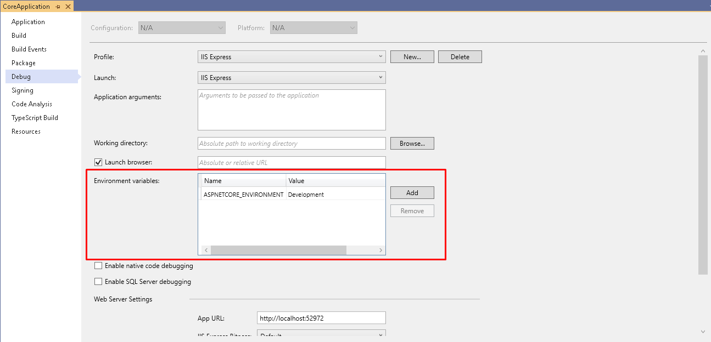
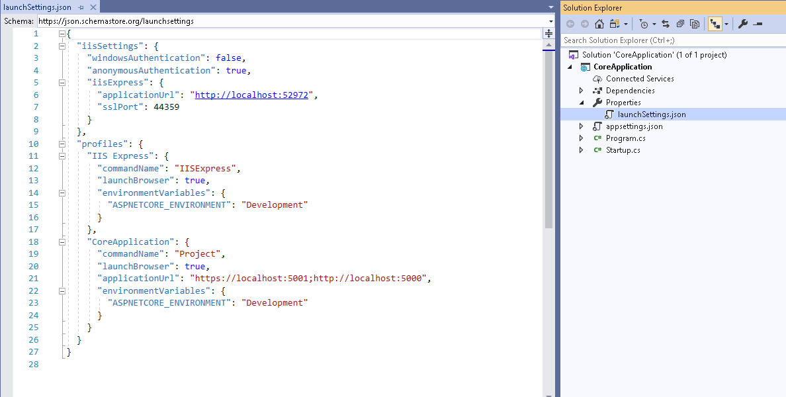

# Runtime Environment

Dentro do processo de engenharia de software, na fase de *deploy*, normalmente encontramos uma separaçao de ambientes, que na maioria dos casos se resume: *Development*, *Staging*, *Production*. Para cada um destes ambientes a aplicação pode alterar alguns comportamentos relacionados a segurança, performance e afins. Por exemplo, em um ambiente de desenvolvimento podemos abrir mão de um controle de cache, que em produção é fundamental ou simplesmente para cada ambiente temos dependência de recursos em endereços diferentes.

Dentro do `asp.net core` temos um tipo de variável que especifica para o runtime qual ambiente estamos em execução. O nome desta variável de ambiente é `ASPNETCORE_ENVIRONMENT` e ela pode ser defina com qualquer valor que faça sentido dentro das fases de desenvolvimento especificadas pela engenharia de software da empresa.

## Setando `ASPNETCORE_ENVIRONMENT` dentro do Visual Studio

Clicar com o botão direito no projeto e selecionar `propriedades`. Na janela de propriedades abrir a aba `Debug`.



Essa configuração realizada via interface de propriedades do projeto, pode ser aberta via `Solution Explorer`, no arquivo `launchSettings.json`.



## Acessando *Environment* via `runtime`

Para usarmos essa variável dentro do código precisamos da seguinte interface para abstrair a leitura `IWebHostEnvironment`. A apartir desta interface podemos acessar o `environment` da seguinte forma:

``` csharp
    public void Configure(IApplicationBuilder app, IWebHostEnvironment env)
    {
        if (env.IsEnvironment("TESTE"))
        {
            // CODIGO A SER EXECUTADO
        }
        else if(env.IsDevelopment())
        {
            // CODIGO A SER EXECUTADO
        }
        else if(env.IsStaging())
        {
            // CODIGO A SER EXECUTADO
        }
        else if(env.IsProduction())
        {
            // CODIGO A SER EXECUTADO
        }
        else
        {
            // CODIGO A SER EXECUTADO
        }
    }
```